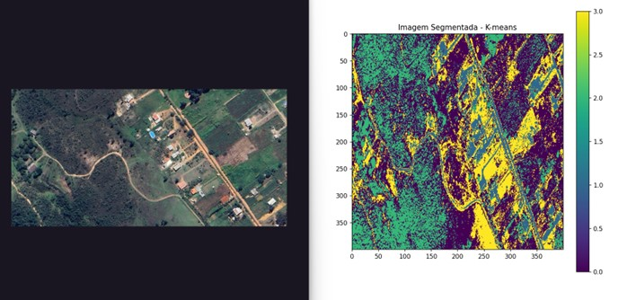
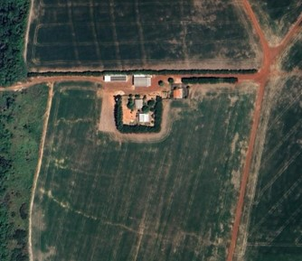
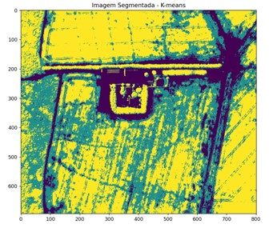
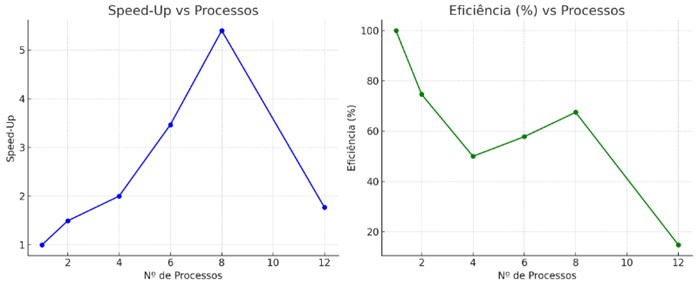

# Identificador de Áreas agrícolas em imagens de satélites

Paralelização de imagens .png para identificação de áreas agrícolas, utilizando o algoritmo de segmentação K-means.

## 1. Introdução
---

Este projeto tem como objetivo identificar áreas agrícolas em imagens de satélite, utilizando o algoritmo de segmentação K-means. O código foi desenvolvido em Python e processa imagens no formato .png, ele divide a imagem em clusters com base nas cores dos pixels, destacando os tons de verde que geralmente representam vegetação.

Além de segmentar as imagens, o código foi adaptado para acelerar esse processo, permitindo que várias imagens sejam processadas ao mesmo tempo. Isso é feito com técnicas de paralelização, aproveitando o poder de múltiplos núcleos de CPU.

Foram utilizadas as seguintes tecnologias:

- **Python**: Linguagem principal para o processamento e análise.
- **Pillow**: Biblioteca para carregamento, manipulação e visualização de imagens.
- **Scikit-learn**: Biblioteca para aplicar o algoritmo de segmentação K-means.
- **Matplotlib**: Biblioteca para visualização das imagens e segmentação.
- **Multiprocessing/Dask**: Para paralelização do processo de segmentação.

O sistema:

- Converte as imagens de satélite no formato .png, para uma representação manipulável (matriz RGB) para segmentação;
- Aplica o algoritmo K-means para segmentar a imagem em diferentes clusters e identificar áreas agrícolas;
- Gera visualizações para mostrar as áreas agrícolas detectadas, sobrepondo a máscara segmentada sobre a imagem original;
- O processo de segmentação será otimizado para ser executado de maneira paralela, aproveitando múltiplos núcleos de processamento.

## 2. Descrição do Problema
---

Com o crescimento da quantidade de imagens de satélite disponíveis gratuitamente, surge a necessidade de analisar grandes volumes de dados de forma automática e eficiente. Identificar áreas agrícolas manualmente é demorado, cansativo e pouco prático em escala.

O desafio principal do projeto é acelerar o processo de segmentação de imagens, para que várias imagens possam ser processadas simultaneamente. O objetivo é tornar esse sistema capaz de lidar com grandes conjuntos de imagens sem perda de desempenho, usando paralelização com múltiplos núcleos de CPU para dividir a carga de trabalho.

## 3. Justificativa
---
A identificação de áreas agrícolas em imagens de satélite tem um papel fundamental em várias aplicações práticas, como o monitoramento ambiental, a gestão do uso da terra, a agricultura de precisão e a formulação de políticas públicas voltadas à produção de alimentos. No entanto, realizar essa análise manualmente, especialmente em grande escala, é inviável — tanto pelo tempo que isso demandaria quanto pela possibilidade de erros humanos.

Por isso, automatizar esse processo com o uso de algoritmos de segmentação é uma solução importante. Além disso, como essas imagens costumam ser pesadas e em grande volume, é essencial otimizar o desempenho do sistema por meio da paralelização, o que torna a ferramenta mais eficiente e escalável.

Este projeto une essas duas frentes — segmentação automática e processamento paralelo — para desenvolver uma solução prática, ágil e adequada para uso em cenários reais.

## 4. Descrição do problema
---

Para resolver o problema de segmentação de áreas agrícolas em imagens de satélite, desenvolvemos uma aplicação em Python utilizando paralelismo com MPI, juntamente com técnicas de clustering com KMeans para identificar regiões com vegetação densa.

Como as imagens usadas no projeto são extremamente grandes (com dimensões maiores a 20.000 pixels), enfrentamos desafios relacionados ao consumo excessivo de memória. Para contornar esse problema e manter a eficiência do sistema, adotamos a seguinte estratégia:

### 1. Paralelismo com MPI

- O código principal (main.py) distribui as imagens entre os processos MPI com base no rank de cada processo;
- Cada processo recebe uma parte da lista de imagens e é responsável por processar somente as imagens;
- Isso permite que várias imagens sejam processadas simultaneamente em diferentes núcleos da CPU.

### 2. Processamento por blocos

- Para evitar que uma única imagem inteira ocupe muita memória, cada imagem é dividida em blocos menores de 2000x2000 pixels;
- Isso garante que mesmo imagens muito grandes possam ser tratadas com consumo de RAM controlado.

### 3. Multithreading por imagem

- A segmentação dos blocos é feita em paralelo dentro de cada processo do MPI;
- Dentro de uma variável definimos manualmente a quantidade de thread que queremos que processe as imagens;
- Cada thread trata um bloco separadamente, aplicando o algoritmo KMeans e desenvolvendo a parte segmentada;
- Os blocos são então reagrupados para formar a imagem final segmentada.

### 4. Segmentação com KMeans

- Para cada bloco, aplicamos o algoritmo de agrupamento KMeans com 3 clusters baseado nas cores RGB dos pixels;
- Identificamos o cluster com maior intensidade no canal verde, o que normalmente representa áreas de vegetação.

### 5. Salvamento de Resultados

- As imagens segmentadas são salvas em pastas separadas por rank, dentro da pasta resultados, facilitando a organização dos dados e a avaliação dos resultados.

## 5. Descrição da solução
---
Para resolver o problema de segmentação de imagens de satélite de forma eficiente e com baixo consumo de memória, foi adotada uma estratégia baseada no processamento por blocos, associada ao uso de paralelismo com MPI e multithreading.

### Processamento por Blocos

Cada imagem foi dividida em blocos menores de 2000x2000 pixels, o que permitiu realizar a segmentação de forma controlada, evitando o estouro de memória mesmo com imagens de grandes dimensões (superiores a 20.000 pixels). Blocos residuais nas bordas, com dimensões inferiores ao padrão (como 872x900), também foram tratados separadamente e incluídos corretamente na reconstrução da imagem final segmentada.

### Segmentação com KMeans

Para cada bloco, foi aplicado o algoritmo de segmentação KMeans com 3 clusters, utilizando as cores RGB dos pixels como base. O cluster que apresentou maior intensidade no canal verde foi considerado representativo das áreas de vegetação/agricultura, sendo destacado no resultado final.

### Paralelismo com MPI

O processamento foi distribuído entre múltiplos processos MPI. Cada processo, identificado por seu rank, recebeu uma parte da lista de imagens para processar de forma independente. Isso permitiu que várias imagens fossem segmentadas simultaneamente, aproveitando múltiplos núcleos da CPU.

### Multithreading por Imagem

Dentro de cada processo MPI, utilizou-se multithreading leve (até 4 threads por imagem) para realizar a segmentação dos blocos em paralelo, o que aumentou ainda mais a eficiência do processamento, sem sobrecarregar a RAM disponível.

### Armazenamento dos Resultados

As imagens segmentadas foram salvas em uma pasta de resultados, facilitando a organização dos arquivos e a análise posterior dos dados processados.

### Resumo das Vantagens e Desvantagens

**Vantagens:**

- Redução do uso de memória RAM;
- Aumento do desempenho por meio de paralelismo (MPI + threads);
- Escalabilidade para grandes volumes de imagens;
- Tratamento completo, inclusive dos blocos residuais.

**Desvantagens:**

- Maior complexidade na implementação do código;
- Pequena sobrecarga adicional durante a reconstrução final da imagem segmentada.

## 6. Resultados
---

Com base nos testes realizados, observamos que o tempo de execução reduziu significativamente ao aumentar o número de processos. No entanto, o ganho de desempenho não foi proporcional, como mostra o gráfico de speed-up. A eficiência do sistema, calculada pela razão entre o speed-up e o número de processos, também apresentou queda à medida que mais processos foram utilizados.

### Tabela de Resultados

| Processos | Tempo (ms) | Speed-Up | Eficiência |
|-----------|------------|----------|------------|
| 1         | 6202.87    | 1.00     | 100%       |
| 2         | 4156.21    | 1.49     | 74.70%     |
| 4         | 3103.72    | 2.00     | 50.00%     |
| 6         | 1789.43    | 3.47     | 57.80%     |
| 8         | 1149.19    | 5.40     | 67.50%     |
| 12        | 3507.32    | 1.77     | 14.80%     |

### Speed-up

O speed-up representa quanto mais rápido o sistema ficou em relação à execução com apenas 1 processo. Por exemplo:

- 2 processos: speed-up ≈ 1.49  
- 4 processos: speed-up ≈ 2.00  
- 8 processos: speed-up ≈ 5.40  
- 12 processos: speed-up ≈ 1.77  

Embora o tempo total tenha diminuído, o speed-up ideal (linear) não foi atingido — o que seria, por exemplo, 12x mais rápido com 12 processos.

### Eficiência

A eficiência é o quão bem o sistema aproveita os recursos disponíveis. Espera-se que fique perto de 1 (ou 100%), mas os resultados mostraram:

- 2 processos: eficiência ≈ 74.5%  
- 4 processos: eficiência ≈ 50%  
- 12 processos: eficiência ≈ 14.80%

Esses dados mostram que, apesar do ganho de desempenho, ele não escala perfeitamente com o aumento no número de processos. Existe uma perda de eficiência associada à sobrecarga de comunicação e ao gerenciamento paralelo.

### Observações Técnicas

Durante os testes com imagens muito grandes (até 27.000 × 27.000 pixels), mesmo com paralelização via MPI, o consumo de memória RAM foi extremamente alto, ocasionando:

- Travamentos do sistema operacional;
- Fechamento inesperado da IDE (VS Code);
- Queda na escalabilidade do projeto.

Esses efeitos evidenciam que, a partir de certo ponto, aumentar o número de processos não significa necessariamente obter um desempenho melhor. Isso reforça a importância de equilibrar o número de processos com os recursos disponíveis.

Após segmentação, as imagens geradas ficaram assim:

  
  
  

Gráfico de SpeedUP e Eficiência:

## 7. Conclusão
---
O projeto teve como objetivo principal desenvolver uma solução eficiente para identificar áreas agrícolas em imagens de satélite, utilizando segmentação com KMeans aliada a técnicas de paralelização com MPI e multithreading.

Os resultados mostraram que a paralelização trouxe ganhos significativos de desempenho, especialmente ao comparar o tempo de execução com 1 processo e com múltiplos processos. No entanto, também ficou evidente que o aumento no número de processos não levou a um ganho proporcional, devido à queda na eficiência e ao alto consumo de memória RAM.

Durante os testes com imagens de grandes dimensões, o sistema enfrentou limitações importantes — como travamentos e falhas por uso excessivo de memória — o que destacou a necessidade de otimizações futuras. Essas melhorias podem envolver o uso de ferramentas mais robustas para processamento paralelo, controle de memória mais refinado, ou até o uso de GPU para operações pesadas.

Ainda assim, o projeto cumpriu sua proposta inicial de automatizar a identificação de áreas agrícolas de forma mais rápida, utilizando segmentação em blocos e paralelização. A solução mostrou-se funcional, adaptável e promissora, sendo um bom ponto de partida para aplicações em larga escala no monitoramento ambiental e na agricultura de precisão.
